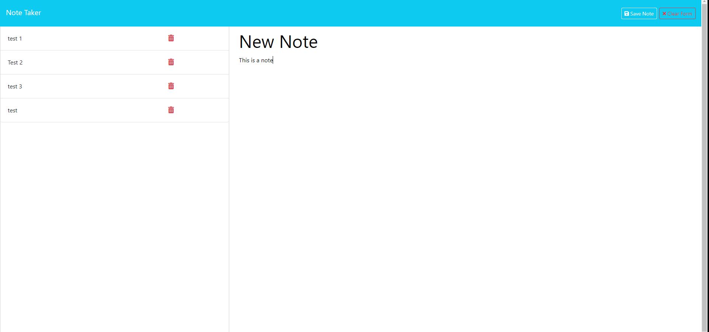

# Note-Taker

## Description
This app is a simple note-taking tool that allows the user to creat notes with titles and a text body that can be saved and reopened.

## Installation
This app utilizes express. use npm i express in the console to download express.

## Usage
User will be presented with a start screen press the get started button to continue. From there old notes are displaied on the left and new notes can be filled in.

https://note-taker16542313-fe843350d4f0.herokuapp.com/

## License 
MIT license

